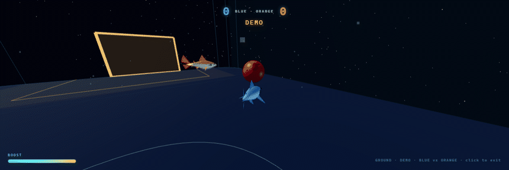
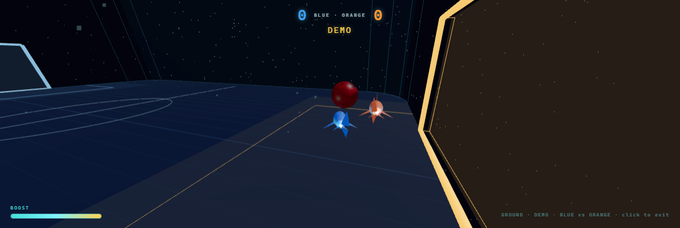
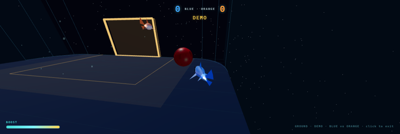

# CHUMBALL

> **Shark soccer in 3D space — Rocket-League-style.** Fly a low-poly 3D shark through a volumetric
> space arena (full 6-axis flight — yaw / pitch / roll) and rocket-boost a bloody soccer ball — the
> **CHUMBALL** — into the opponent's goal, versus an AI bot shark. Runs in any browser, full
> controller support, no install.

<p align="center">
  <a href="https://brendanwelsh.github.io/chumball/"><b>▶&nbsp; Play it live</b></a>
  &nbsp;·&nbsp; gamepad or mouse&nbsp;+&nbsp;keyboard
</p>

<p align="center">
  
</p>

<table>
  <tr>
    <td width="50%" align="center"><br><b>50/50 at the mouth</b> — both sharks boost the ball at the net</td>
    <td width="50%" align="center"><br><b>Supersonic approach</b> — bank in; the bot drops back to defend</td>
  </tr>
</table>

---

## What it is

**Rocket League with sharks, in space.** You pilot a sculpted 3D shark with real momentum — drive on
the floor like a car, then jump, boost and **air-roll** for full 3D aerials — and smash the
gravity-bound **CHUMBALL** into the orange net while defending your blue one. Two-minute match,
sudden-death overtime, a competent AI opponent, and a bot-vs-bot attract mode. One file of game code
on vendored **Three.js** — no framework, no bundler, just static files.

---

## How it plays

- **Ground vs air, like Rocket League.** On the floor you steer with grip and a **powerslide** drift;
  jump and you're airborne with full **pitch / yaw / roll**, gravity, boost and air-roll. Land and you
  re-level onto the wheels. The HUD shows **GROUND / AIR**.
- **Flight feel.** An RL-style throttle curve, a finite **boost** tank, a supersonic top-speed cap, and
  a two-stage **jump → double-jump / dodge-flip**. Every feel knob lives in one `CFG` block in `game.js`.
- **Ball & goals.** The CHUMBALL has gravity, drag and zero-g float; it bounces off walls, roof and
  floor and takes an impulse from each shark hit scaled by your speed. Goals sit at **±Z** — orange is
  the net you attack, blue the one you defend.
- **The bot.** Leads the ball, drops back to defend, circles behind, then charges through with boost.
  Demo mode drives both sharks for the reel above.

---

## Controls

Plug in a **DualSense / standard gamepad**, or play with **mouse + keyboard**. Controls change between
**GROUND** and **AIR** (shown on the HUD).

### 🎮 Controller

| Input | Action |
|---|---|
| **R2 / L2** | Throttle / brake-reverse |
| **R1** | Boost (supersonic) |
| **Cross (✕)** | Jump → press again for double-jump, or **+ stick = directional dodge-flip** |
| **Left stick** | **Ground:** steer · **Air:** pitch + yaw |
| **L1** | **Ground:** powerslide / drift · **Air:** free air-roll (hold → stick X = roll) |
| **Square / Circle** | Directional air-roll left / right |
| **Triangle** | Ball-cam toggle |

### ⌨️ Mouse + keyboard

| Input | Action |
|---|---|
| **Mouse** | **Ground:** steer · **Air:** pitch + yaw (up = nose up) · **A / D** also steer |
| **W / S** | Throttle / reverse (auto-cruise otherwise) |
| **Shift / Click** | Boost |
| **Space** | Jump → again for double-jump / dodge |
| **Ctrl** | **Ground:** powerslide · **Air:** free air-roll (hold → mouse X = roll) |
| **Q / E** | Directional air-roll left / right |
| **C** | Ball-cam |

You're **blue**: smash the CHUMBALL into the orange goal, defend the blue one.

---

## Run it

Play online at **[brendanwelsh.github.io/chumball](https://brendanwelsh.github.io/chumball/)** — nothing
to install. To hack on it locally, serve over http (Three.js is a vendored ES module, blocked on
`file://`):

```sh
python -m http.server 8009   # then open http://localhost:8009/
```

`game.js` is the whole game (shark, flight, ball physics, bot AI, match logic); `CFG` at the top is the
one place to tune feel. URL hooks: `#play` starts a match, `#demo` runs bot-vs-bot.

---

*Built on [Three.js](https://threejs.org) (vendored).*
